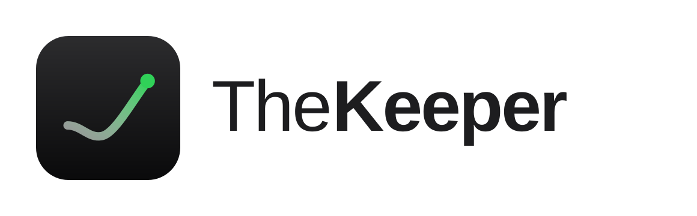

<p align="center"></p>

TheKeeper builds agent skills for OKX Global users. Each skill lives in its own folder, installs on its own, and shares no code or state with the others.

| Skill | What it does | License |
|---|---|---|
| [AvgKeeper](avgkeeper/) | Buys into the spot coins you hold at a loss, on a schedule you set. At every buy it re-reads each coin's loss and splits the budget again, equally or weighted by loss size. | MIT |

## Get it

```bash
git clone https://github.com/yekaradeniz/thekeeper.git
```

Then follow the Install section of [avgkeeper/README.md](avgkeeper/README.md). Run its commands from inside the `thekeeper` folder.

## Status

This build carries no AI Builder Code from OKX yet. Until an update carries one, AvgKeeper refuses every plan and buys nothing. `holdings` and `doctor` still work.
