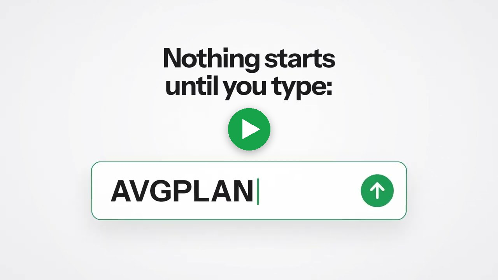

<p align="center"></p>

<p align="center"><a href="https://www.youtube.com/watch?v=TuLtIcn6JDE"></a></p>
<p align="center"><a href="https://www.youtube.com/watch?v=TuLtIcn6JDE"><b>▶ Watch the AvgKeeper video</b></a></p>

TheKeeper builds agent skills for OKX Global users. Each skill lives in its own folder, installs on its own, and shares no code or state with the others.

| Skill | What it does | License |
|---|---|---|
| [AvgKeeper](avgkeeper/) | Buys into the spot coins you hold at a loss, on a schedule you set. At every buy it re-reads each coin's loss and splits the budget again, equally or weighted by loss size. | MIT |

## AvgKeeper

AvgKeeper reads your OKX Global account, finds the spot coins that are below OKX's own average buy price, and buys them on your schedule with a fixed USDT budget.

### How it differs from OKX's recurring buy

OKX's recurring buy fixes the coins and the ratios when you create it. AvgKeeper reads your account again at every buy:

- A coin that moved into profit drops out of that buy.
- A coin whose loss deepened gets a larger share.
- A coin you bought since the last run joins the split if it is in loss.

### Example

A 10 USDT budget, split by loss size, with three coins in loss at buy time. The numbers are an illustration, not a forecast.

| Coin | Loss at buy time | Share of the 10 USDT |
|---|---|---|
| SOL | 20% | 5.71 USDT |
| ETH | 10% | 2.86 USDT |
| BTC | 5% | 1.43 USDT |

With the equal split, each coin gets the same share instead. If SOL is back in profit at the next buy, the next budget goes to ETH and BTC only.

### What you choose

| Setting | Options |
|---|---|
| How often | every hour, every day, every N days, weekly on a weekday, monthly on a day |
| Budget per buy | any USDT amount |
| Split | equal, or weighted by loss size |
| Coins | every coin in loss, all except some, or only some |
| Email notices | off, only problems, or every buy with its details |

AvgKeeper leaves out coins worth under 10 USDT (you can change this threshold) and dollar stablecoins. When a coin's share is below OKX's minimum order size, that share goes to the other coins.

### How you use it

You talk to your AI agent (Claude Code, for example):

1. "Show my holdings with AvgKeeper." It lists your coins and which ones are in loss.
2. "Make a plan: 10 USDT every day, weighted by loss." The agent asks for each setting and shows a plan card with every number.
3. You type `AVGPLAN` to confirm. Nothing is bought before that word.
4. The same `AVGPLAN` adds AvgKeeper's own schedule entry on your computer: a launchd job on macOS, a marked crontab entry on Linux. The receipt says `Schedule installed` with the time it wakes, or `FAIL:` with the reason and what to do next.
5. "Show AvgKeeper status" at any time shows the running plan and recent buys. "Stop AvgKeeper" ends the plan and removes its schedule entry. Your coins stay where they are.

### Safety

- The agent never sees your API key. You save it on your own computer with the official okx CLI, with Read and Trade on and Withdraw off.
- Market orders only, spot only. No leverage, no margin, no withdrawals.
- Every order is read back from OKX after it is placed. An order whose result cannot be read stops the plan and names the order to check.
- AvgKeeper writes a schedule entry only after you type `AVGPLAN`, and removes it when you stop the plan. It touches only its own entry for that profile; every other crontab line stays as it was. The agent never edits a crontab or a LaunchAgent itself. You choose when it runs.
- Start on an OKX demo account first. It uses practice money only.
- AvgKeeper is a tool, not investment advice. Averaging down into a coin that keeps falling increases your loss.

### Requirements

- macOS or Linux (no native Windows build)
- Node 18 or newer
- The official okx CLI and an OKX Global API key
- An AI agent that loads skills, such as Claude Code

## Get it

```bash
git clone https://github.com/yekaradeniz/thekeeper.git
```

Then follow the Install section of [avgkeeper/README.md](avgkeeper/README.md). Run its commands from inside the `thekeeper` folder.

## Status

This build carries no AI Builder Code from OKX yet. Until an update carries one, AvgKeeper refuses every plan and buys nothing. `holdings` and `doctor` still work.

## License

Each skill folder carries its own LICENSE file, and that file governs the folder. Everything else in this repository is under the MIT license in [LICENSE](LICENSE).
